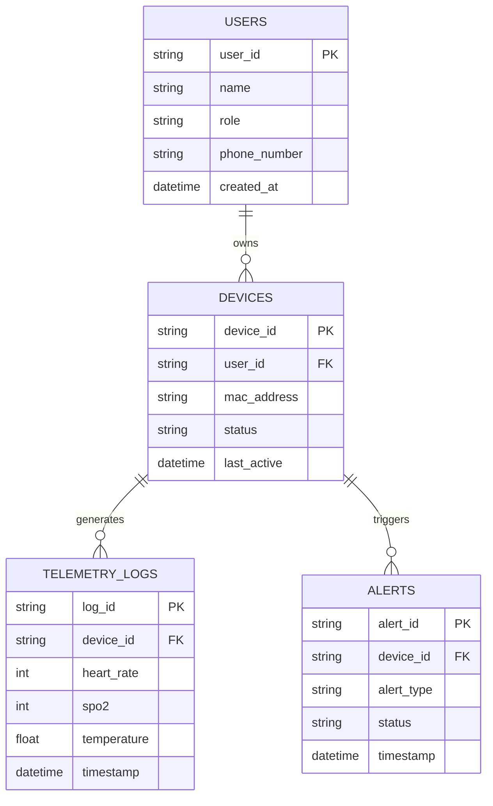
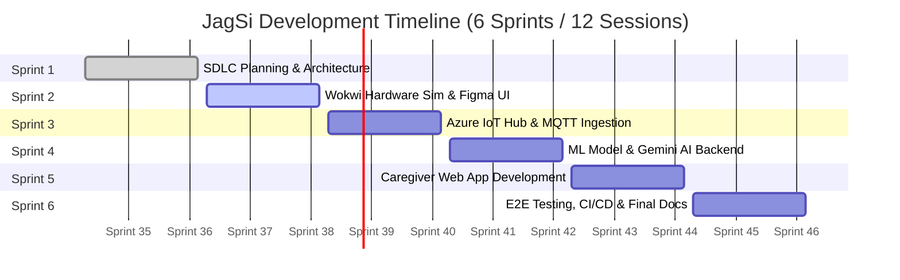
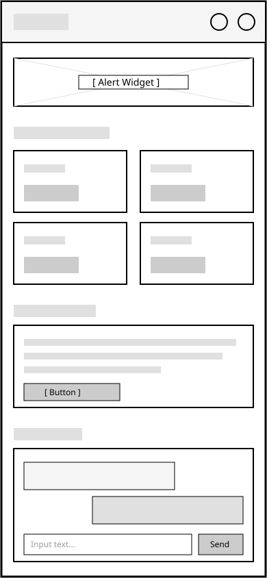

# JagSi (Jaga Lansia) — Senior Project Documentation

## Product Goals
To build an accessible, cloud-connected wearable health-monitoring ecosystem that provides real-time vital sign tracking, automated fall detection, emergency alerts, and AI-driven health risk summaries for elderly individuals and their primary caregivers.

## Potential Users and Needs
* **Elderly Individuals:** Require simple, non-intrusive wearable hardware equipped with vital sensors and an accessible physical SOS button with zero UI learning curve.
* **Family Caregivers:** Require a web dashboard offering live health metrics, instant push notifications for fall events, and simplified AI explanations of telemetry.
* **Healthcare Providers:** Require organized historical health trends (heart rate, SpO2, temperature) to evaluate overall patient conditions.

---

## Functional Requirements
| FR | Description |
| :--- | :--- |
| **FR 1** | The simulated ESP32 wearable must collect and stream heart rate, SpO2, and body temperature telemetry to Azure IoT Hub via MQTT every 10 seconds. |
| **FR 2** | The cloud backend must process accelerometer/gyroscope vectors using an ML model to detect fall impacts and dispatch emergency alerts within 5 seconds. |
| **FR 3** | The system must allow users to trigger a manual emergency SOS alert by holding the wearable's physical button for >2 seconds. |
| **FR 4** | The web dashboard must integrate the Gemini API to analyze raw telemetry and deliver simplified health risk summaries in Bahasa Indonesia. |

---

## Entity Relationship Diagram (ERD)

---

## Gantt-Chart Sprint Based

## UI/UX Design & Low-Fidelity Wireframes

Below is the initial low-fidelity component breakdown for the JagSi Caregiver Web App:

* **Header:** Navigation, real-time alerts, user profile.
* **Alert Banner:** Prominent notification strip for critical fall events (UC-02 / UC-03).
* **Telemetry Grid:** Live monitoring cards for Heart Rate, SpO2, Body Temp, and Battery status.
* **AI Health Digest:** Section summarizing daily vital trends via Gemini API (Bahasa Indonesia).
* **AI Chat Assistant:** Interactive prompt area for caregiver health queries.

