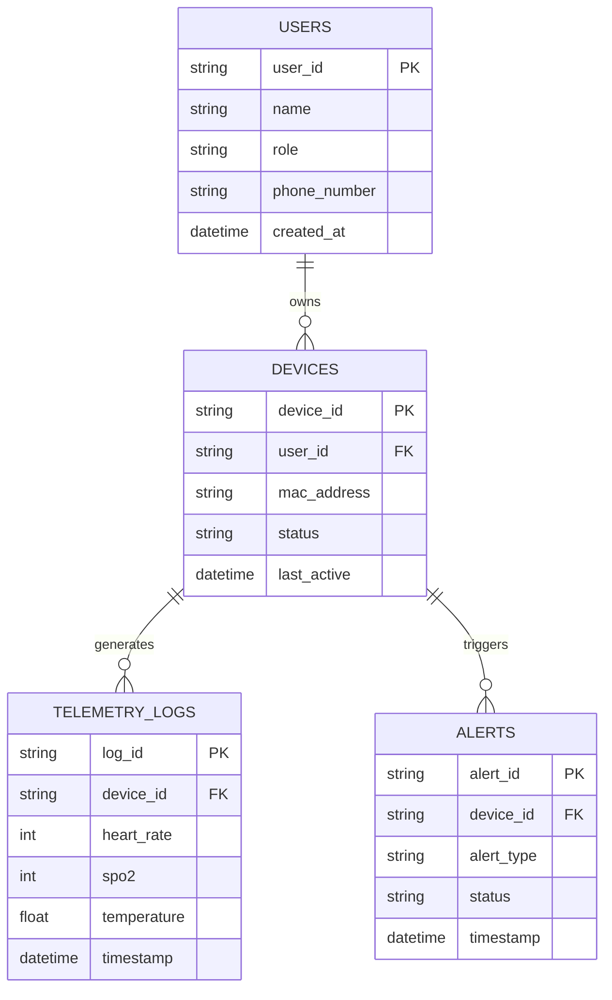
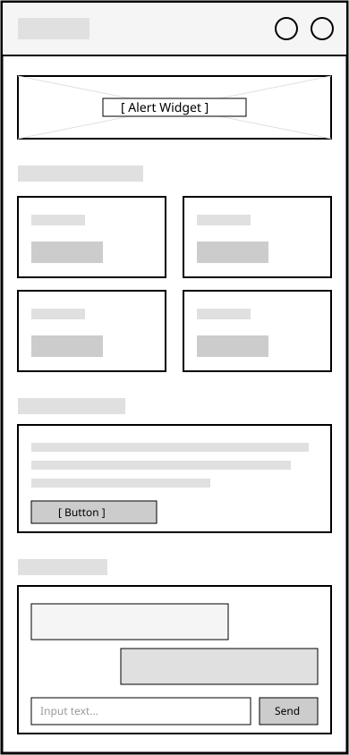

# JagSi (Jaga Lansia) — Senior Project Documentation

**Live Documentation Portal**: [https://akhnafyooga.github.io/JagSi/](https://akhnafyooga.github.io/JagSi/)

---

## Product Goals
To build an accessible, cloud-connected wearable health-monitoring ecosystem that provides real-time vital sign tracking, automated fall detection, emergency alerts, and AI-driven health risk summaries for elderly individuals and their primary caregivers.

---

## Potential Users and Needs
* **Elderly Individuals**: Require simple, non-intrusive wearable hardware equipped with vital sensors and an accessible physical SOS button with zero UI learning curve.
* **Family Caregivers**: Require a web dashboard offering live health metrics, instant push notifications for fall events, and simplified AI explanations of telemetry.
* **Healthcare Providers**: Require organized historical health trends (heart rate, SpO2, temperature) to evaluate overall patient conditions.

---

## Functional Requirements

| FR | Description |
| :--- | :--- |
| **FR 1** | The simulated ESP32 wearable must collect and stream heart rate, SpO2, and body temperature telemetry to Azure IoT Hub via MQTT every 10 seconds. |
| **FR 2** | The cloud backend must process accelerometer/gyroscope vectors using an ML model to detect fall impacts and dispatch emergency alerts within 5 seconds. |
| **FR 3** | The system must allow users to trigger a manual emergency SOS alert by holding the wearable’s physical button for >2 seconds. |
| **FR 4** | The web dashboard must integrate the Gemini API to analyze raw telemetry and deliver simplified health risk summaries in Bahasa Indonesia. |

---

## Entity Relationship Diagram (ERD)


```mermaid
erDiagram
    USERS ||--o{ DEVICES : owns
    DEVICES ||--o{ TELEMETRY_LOGS : generates
    DEVICES ||--o{ ALERTS : triggers

    USERS {
        string user_id PK
        string name
        string role
        string phone_number
        datetime created_at
    }

    DEVICES {
        string device_id PK
        string user_id FK
        string mac_address
        string status
        datetime last_active
    }

    TELEMETRY_LOGS {
        string log_id PK
        string device_id FK
        int heart_rate
        int spo2
        float temperature
        datetime timestamp
    }

    ALERTS {
        string alert_id PK
        string device_id FK
        string alert_type
        string status
        datetime timestamp
    }
```
## Gantt-Chart or Sprint Status
```
gantt
    title JagSi 3-Sprint SDLC Timeline
    dateFormat  YYYY-MM-DD
    axisFormat  %b %d

    section Sprint 1: Hardware & UI Setup
    README Setup & Product Descriptions (#14)  :done, task14, 2026-09-19, 2026-10-02
    Design UI/UX Wireframes & Component Kit (#11) :active, task11, 2026-09-19, 2026-10-02
    Interface ESP32 on Wokwi (#5)              :task5, 2026-09-19, 2026-10-02
    Program MQTT Pub/Sub Pipeline (#6)         :task6, 2026-09-19, 2026-10-02
    Assemble Casing & Wearable Prototype (#7)  :task7, 2026-09-19, 2026-10-02

    section Sprint 2: Cloud Infrastructure & AI
    Deploy Azure IoT Hub & Event Grid (#8)     :task8, 2026-10-03, 2026-10
```

## UI/UX Design & Low-Fidelity Wireframe
UI/UX Design & Low-Fidelity Wireframes
Below is the initial low-fidelity component breakdown for the JagSi Caregiver Web App:



Header: Navigation bar, real-time status/alerts indicator, user profile.

Alert Banner: Prominent notification strip for critical fall events or manual emergency SOS triggers.

Telemetry Grid: Live monitoring cards for Heart Rate, SpO2, Body Temperature, and Battery status.

AI Health Digest: Section summarizing daily vital trends via Gemini API in Bahasa Indonesia.

AI Chat Assistant: Interactive prompt area for caregiver health queries and AI-assisted updates.
